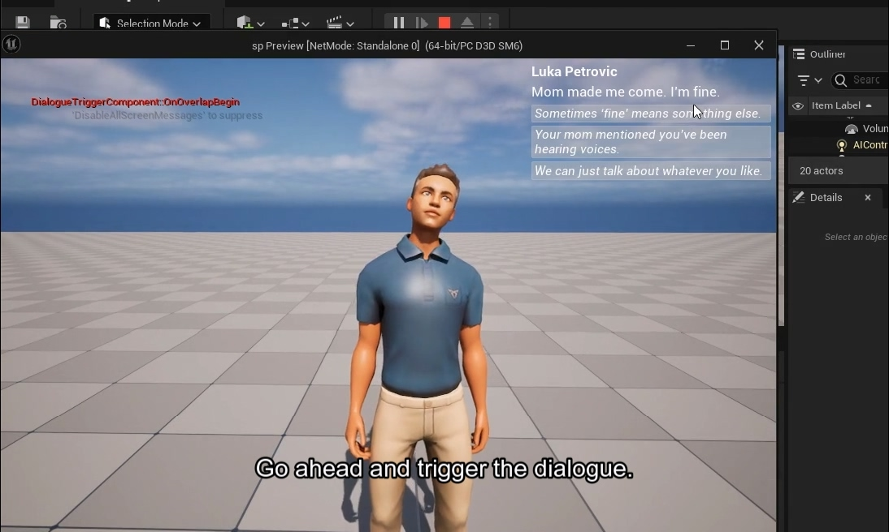

# Minimal Dialogue System for project SP

<!-- TOC -->

- [Minimal Dialogue System for project SP](#minimal-dialogue-system-for-project-sp)
    - [Features](#features)
    - [Usage](#usage)
    - [Project Structure & Class Relationships](#project-structure--class-relationships)
        - [Core Classes](#core-classes)
        - [Rough Relations of Classes When Used](#rough-relations-of-classes-when-used)
    - [Placeholder Assets](#placeholder-assets)

<!-- /TOC -->

This project is a modular dialogue trigger system for NPCs, made for the larger game project SP.

It allows NPCs to optionally carry dialogue data and trigger conversations when the player overlaps with a collision box. The system is built with both C++ classes and blueprints.

Unreal 5.3.2 was used while developing this.

## Features

- A DialogueManager to handle dialogue branches and dialogue line progressions.
- An attachable DialogueTriggerComponent to add dialogue functionality to any NPC (or other actor).
- Base NPC actor that can be extended with components.
- Collision-based dialogue activation using a configurable UBoxComponent.
- Dialogue data loading from external files via UDialogueDataLoader.

Demo video hosted on Youtube (~2 min):

<a href="https://youtu.be/yQ0b-CCx0Xs">
  
</a>

## Usage

1. Add UDialogueTriggerComponent to some NPC.
2. Adjust TriggerBox size in the component’s details panel.
3. Provide a dialogue file path.
4. Place the NPC in a level map.
5. When the player overlaps the trigger, the dialogue system activates.

## Project Structure & Class Relationships

### Core Classes

ANPCBase

Represents the core NPC actor.
Can be just a static mesh, skeletal mesh, or character class.
Does not hardcode dialogue logic — instead relies on attached components.

UDialogueTriggerComponent (inherits USceneComponent)

- A reusable component that can be attached to any actor (e.g., ANPCBase).
- Contains:
    - TriggerBox (UBoxComponent): the overlap volume used to fire dialogue events.
    - DialogueFilePath: path to the dialogue data file.
    - DialogueData: internal map of dialogue nodes (loaded at runtime).
- Handles:
    - Overlap detection (OnOverlapBegin).
    - Dialogue start & end callbacks.

UDialogueDataLoader

A helper class responsible for loading dialogue from external files into DialogueData.


### Rough Relations of Classes When Used

```
ANPCBase
 └── UDialogueTriggerComponent
        └── UBoxComponent (TriggerBox)
```

## Placeholder Assets

The placeholder character used is from [this sketchfab model](https://sketchfab.com/3d-models/character-4-123a5f0aa99a4e6aa87bb2c487455b83), made by iansilvadaher.
